# About
## EN
<p>This repository contains the final project of data structure course in my college</p>

## ID
<p>Repositori ini berisi tugas besar dari mata kuliah struktur data di kampus saya</p>

# Get this Code
```
git clone https://github.com/LanCreates/2022_tubes.git
```

# Run this Code
<p>On terminal, do the following command. Make sure the current directory is the directory which has each items on this repository.</p>

```
g++ *.cpp
./a.exe
```

# Demonstration
> Disclaimer: Ada beberapa data default yang telah disediakan <br>
> Untuk menghapusnya, silakan menghapus seluruh file dengan ekstensi .txt

### Menambah User Baru
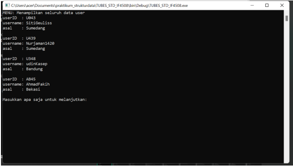

### Menampilkan Data User X
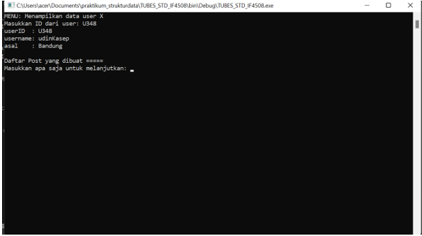

### Menghapus User Tertentu
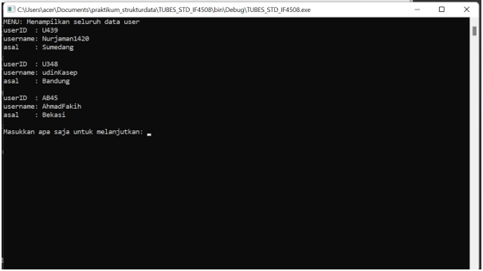

### Mencari User X
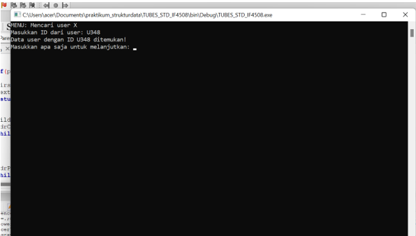

### Menambahkan Post dari User X


### Menghapus Post dari User X
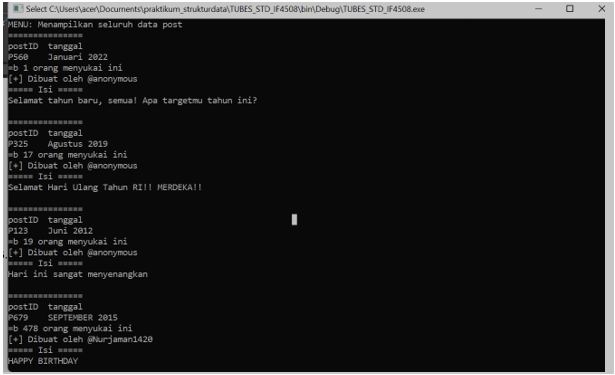

### Menampilkan Seluruh Post dari User X
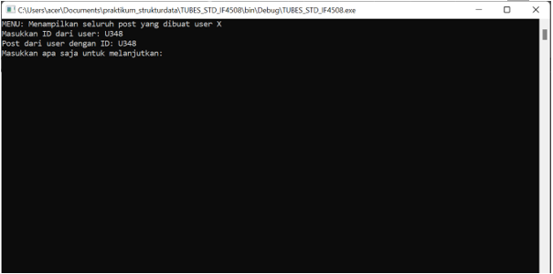

### Mencari Post Y dari user X
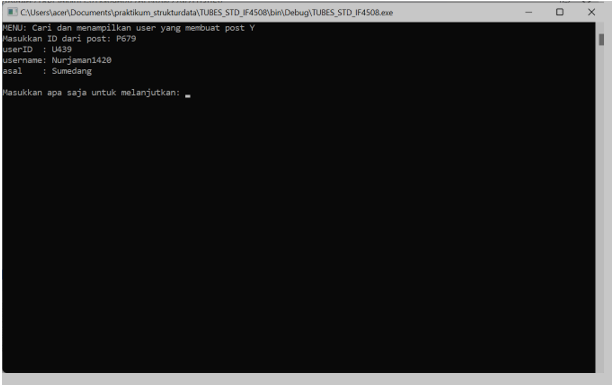

### Membuat Relasi Antara User X dan Post Y
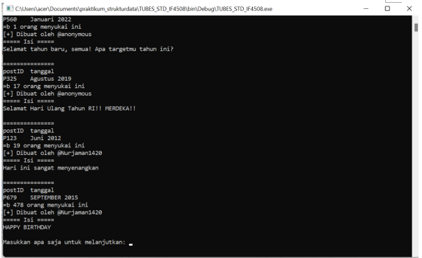

### Menghapus Relasi Antara User X dan Post Y
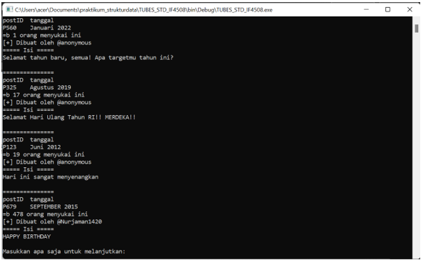

### Menampilkan User yang Memiliki Jumlah Post Terbanyak dan Menampilkan Post Tersebut
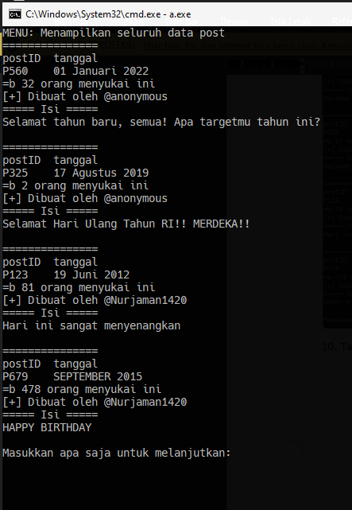
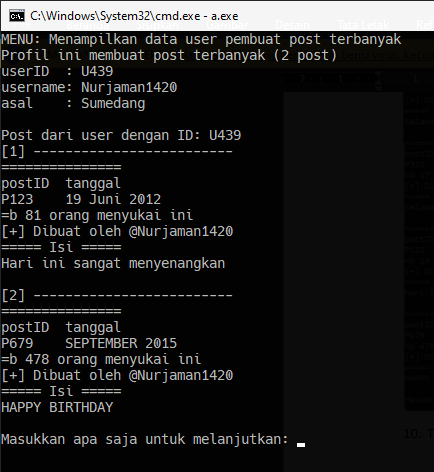

### Mencari Nama User dari Post Y


